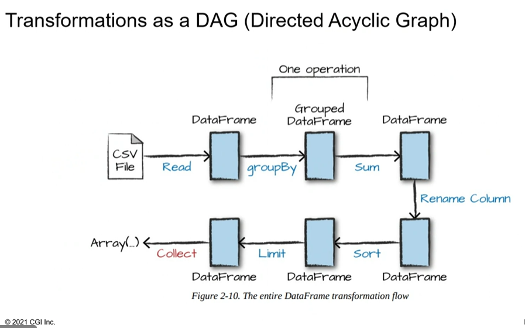
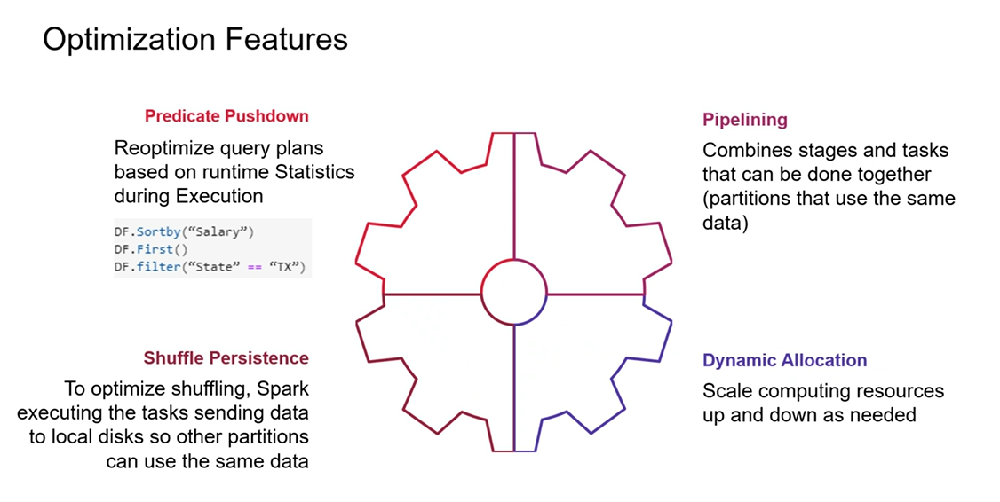
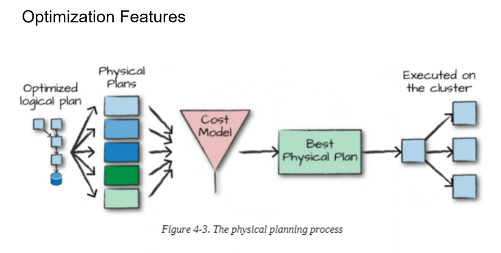

# Spark

> Matthew Brenned | Data Science & Engineering Consultant

## INTRO

- Big Data
  - Volume, velocity, variety, veracity
  - Treated differently? More than one machine / core / distributed processing
  - Challenges?
  - Examples - Netflix, 
- High level overview of capabilities

- Unified

## Architecture

- MLLib - machine learning
- Streaming - real-time analytcs
- SQL - interactive queries
- GraphX - Graph database

- R
- Python
- Scala - native language
- Jave

- Parquet files
  - Not human readable
  - Partitions where data split and stored efficiently

#### Architecture

- Data is physically partitioned

### JOB

- Parallel computation consisting of multiple tasks in response to actions
### STAGE

- Each job divided in smaller set of tasks in stages
### TASK

- Individual action
## DataFrames

- Immutable
- Distributed tables
- Fastest structures to perform operations

- Wide vs narrow
- Do partitions need to interact or can they be executed

## WOrk in notebooks

- `show()` by column
- `.take()` by row
- `.df.describe().show()` like PANDAS describe - but remember you have to show
## Optimizing Features

### Broadcast Variables

- Smaller dataset (< 10 MB) cached to each executor node
- Read only
- Lookup table, commonly referenced - cached TX-Texas, state abbreviation lookup without joining
- Need to define on our own - stored on each executor. Redundant data, needs to be small, but won't have to talk to other executors to access data - avoids shuffeling, no re-reading anything outsied

### Accumulators

- Update variable inside driver node
- Mutable
- Like a counter or sum

## Preparing for Spark Exam

- 
